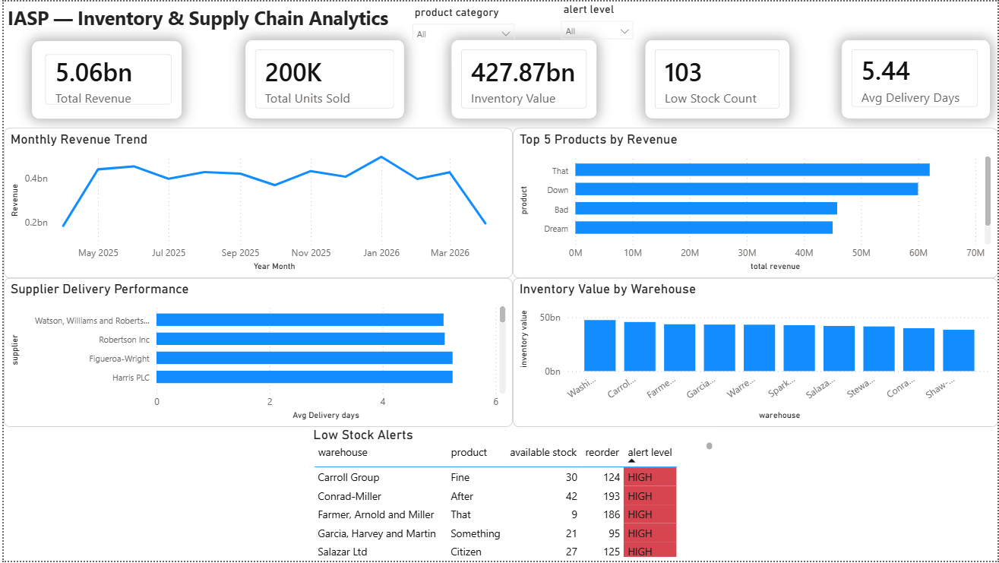
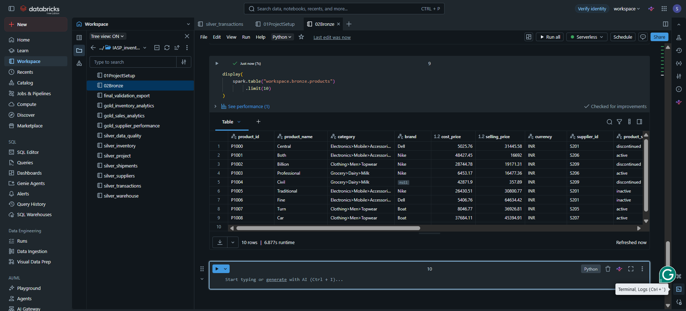
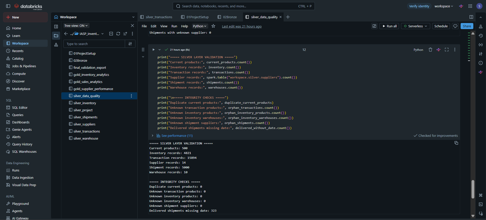
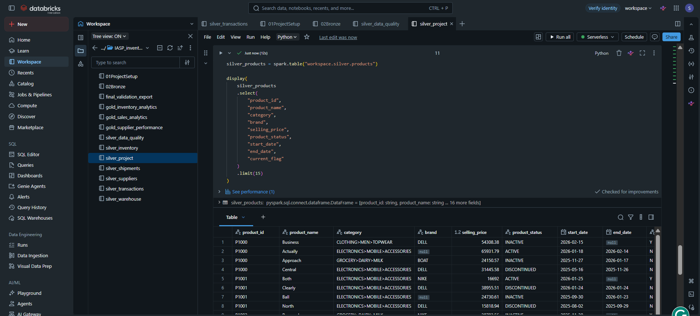
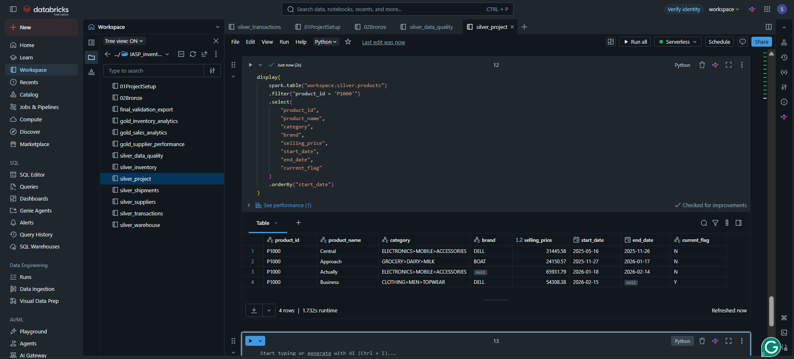
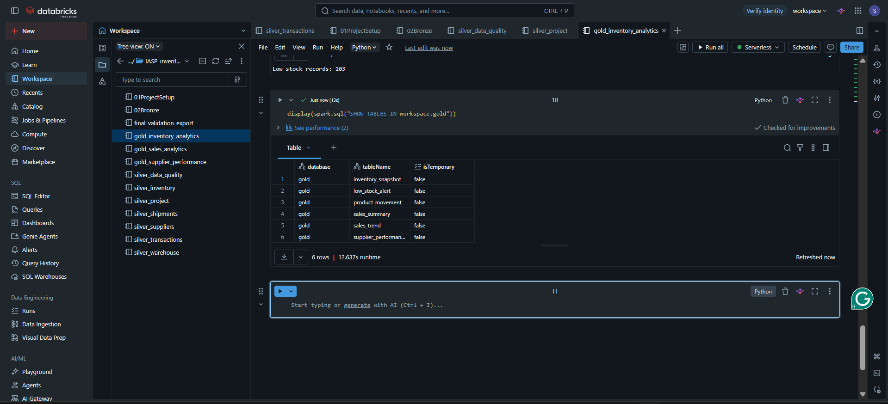
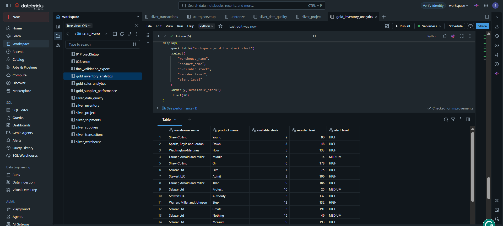

# IASP --- Inventory and Supply Chain Analytics Pipeline

An end-to-end data engineering project developed as the final individual
project for the **Celebal Technologies Data Engineering Internship**.

IASP processes inventory and supply chain data through a **Medallion
Architecture (Bronze → Silver → Gold)** using **Azure, Databricks,
Apache Spark, Delta Lake, and Power BI**. Raw CSV data is transformed
into cleaned, validated, analytics-ready datasets and an interactive
executive dashboard.

------------------------------------------------------------------------

## Project Objectives

-   Ingest six related CSV datasets
-   Preserve raw data in a Bronze layer
-   Clean, standardize, and validate data in a Silver layer
-   Maintain product history using **SCD Type 2**
-   Perform referential integrity and data quality checks
-   Build business-ready Gold tables
-   Visualize supply chain and inventory KPIs in Power BI

------------------------------------------------------------------------

## Architecture


``` text
6 CSV Source Files
        ↓
Azure Data Lake Storage Gen2 / Raw Landing
        ↓
Azure Databricks + Apache Spark
        ↓
Bronze Layer
Raw Delta Tables + Ingestion Metadata
        ↓
Silver Layer
Cleaning + Validation + Standardization + SCD Type 2
        ↓
Gold Layer
Business Aggregations + KPIs
        ↓
Power BI
Executive Analytics Dashboard
```

> **Implementation note:** The project was developed using
> free-tier/free-edition resources. Raw files were also made available
> through a Databricks Unity Catalog Volume for processing where
> free-edition platform restrictions affected direct storage
> configuration.

------------------------------------------------------------------------

## Technology Stack

  Technology                     Purpose
  ------------------------------ -------------------------------------------
  Microsoft Azure                Cloud infrastructure and storage
  Azure Data Lake Storage Gen2   Raw data landing/storage
  Azure Databricks               Data engineering and notebook development
  Apache Spark / PySpark         Distributed data processing
  Delta Lake                     Reliable Bronze, Silver, and Gold tables
  Unity Catalog                  Data organization and governed access
  Python                         Transformation and validation logic
  Power BI Desktop               Dashboard and visualization
  GitHub                         Version control and project submission

------------------------------------------------------------------------

## Source Datasets

  ------------------------------------------------------------------------
  Dataset                                Raw Records Description
  --------------------- ---------------------------- ---------------------
  `products.csv`                               2,000 Product master and
                                                     historical product
                                                     data

  `inventory.csv`                             10,000 Product stock across
                                                     warehouses

  `suppliers.csv`                                 20 Supplier information

  `warehouses.csv`                                10 Warehouse master data

  `transactions.csv`                          20,000 Inventory and
                                                     sales-related
                                                     transactions

  `shipments.csv`                              5,000 Shipment and delivery
                                                     information
  ------------------------------------------------------------------------

------------------------------------------------------------------------

## Medallion Architecture

### Bronze Layer --- Raw Ingestion

The Bronze layer preserves source data with minimal transformation.

Key operations: - Read all six source CSV files - Preserve source
columns - Add ingestion metadata - Add source file information - Store
data as Delta tables

Bronze schema:

``` text
workspace.bronze
```

### Silver Layer --- Cleaning and Validation

The Silver layer converts raw records into trusted datasets.

Main transformations: - Duplicate handling - Null-value handling - Data
type casting - Text standardization - Date conversion - Business-rule
validation - Referential integrity checks - Invalid-record filtering
where required - Product history management using SCD Type 2

Silver schema:

``` text
workspace.silver
```

### Silver Validation Results

  Dataset              Validated Records
  ------------------ -------------------
  Current Products                   500
  Inventory                        4,821
  Transactions                    15,894
  Suppliers                           14
  Shipments                        5,000
  Warehouses                          10

Integrity checks: - 0 duplicate current products - 0 unknown transaction
products - 0 unknown inventory products - 0 unknown inventory
warehouses - 0 unknown shipment suppliers

A shipment quality check also identified delivered records with missing
delivery dates. This was retained as a visible data-quality finding
rather than hidden from validation reporting.

------------------------------------------------------------------------

## SCD Type 2 --- Product History

The product dataset contains multiple versions of the same product.
**Slowly Changing Dimension Type 2** preserves historical changes using:

-   `start_date`
-   `end_date`
-   `current_flag`

This allows the pipeline to preserve historical versions while
identifying one current product record.

``` text
product_id | start_date | end_date   | current_flag
P1000      | 2025-05-16 | 2025-11-26 | N
P1000      | 2025-11-27 | 2026-01-17 | N
P1000      | 2026-01-18 | 2026-02-14 | N
P1000      | 2026-02-15 | NULL       | Y
```

------------------------------------------------------------------------

## Gold Layer --- Business Analytics

Gold schema:

``` text
workspace.gold
```

  -----------------------------------------------------------------------
  Gold Table                          Purpose
  ----------------------------------- -----------------------------------
  `inventory_snapshot`                Current inventory position and
                                      inventory value

  `low_stock_alert`                   Products requiring replenishment
                                      attention

  `product_movement`                  Product-level movement analysis

  `sales_summary`                     Product revenue and units sold

  `sales_trend`                       Monthly revenue trend analysis

  `supplier_performance`              Supplier delivery and delay
                                      performance
  -----------------------------------------------------------------------

------------------------------------------------------------------------

## Data Quality Checks

The pipeline checks: - Duplicate records - Missing critical
identifiers - Invalid product references - Invalid warehouse
references - Invalid supplier references - Null and malformed values -
Date consistency - SCD Type 2 current-record uniqueness - Shipment
delivery-date completeness

------------------------------------------------------------------------

## Power BI Dashboard



### KPI Cards

-   **Total Revenue:** 5.06bn
-   **Total Units Sold:** 200K
-   **Inventory Value:** 427.87bn
-   **Low Stock Count:** 103
-   **Average Delivery Days:** 5.44

### Dashboard Visuals

-   Monthly Revenue Trend
-   Top 5 Products by Revenue
-   Supplier Delivery Performance
-   Inventory Value by Warehouse
-   Low Stock Alerts
-   Product Category slicer
-   Alert Level slicer

------------------------------------------------------------------------

## Project Evidence

### Azure Raw Data


### Bronze Layer




### Silver Layer





### SCD Type 2



### Gold Layer





------------------------------------------------------------------------

## Repository Structure

``` text
IASP-Inventory-Supply-Chain-Pipeline/
├── README.md
├── requirements.txt
├── data/
│   └── sample/
│       ├── products.csv
│       ├── inventory.csv
│       ├── suppliers.csv
│       ├── warehouses.csv
│       ├── transactions.csv
│       └── shipments.csv
├── notebooks/
│   ├── 01_Project_Setup.ipynb
│   ├── 02_Bronze_Layer.ipynb
│   ├── 03_Silver_Products.ipynb
│   ├── 04_Silver_Inventory.ipynb
│   ├── 05_Silver_Transactions.ipynb
│   ├── 06_Silver_Suppliers.ipynb
│   ├── 07_Silver_Shipments.ipynb
│   ├── 08_Silver_Warehouses.ipynb
│   ├── 09_Data_Quality_Validation.ipynb
│   └── 10_Gold_Layer.ipynb
├── powerbi/
│   └── IASP_Inventory_Supply_Chain_Dashboard.pbix
└── docs/
    ├── architecture/
    │   └── IASP_Architecture.png
    └── screenshots/
        ├── 01_azure_storage_raw_files.png
        ├── 02_databricks_workspace.png
        ├── 03_bronze_ingestion_counts.png
        ├── 04_bronze_raw_data.png
        ├── 05_silver_validation.png
        ├── 06_silver_cleaned_data.png
        ├── 07_scd_type2_products.png
        ├── 08_gold_tables.png
        ├── 09_gold_business_output.png
        └── 10_powerbi_dashboard.png
```

------------------------------------------------------------------------

## How to Run

1.  Place the six CSV files in the configured raw-data location.
2.  Run `01_Project_Setup.ipynb`.
3.  Run `02_Bronze_Layer.ipynb`.
4.  Run all Silver-layer notebooks.
5.  Run `09_Data_Quality_Validation.ipynb` and review the checks.
6.  Run `10_Gold_Layer.ipynb`.
7.  Open `powerbi/IASP_Inventory_Supply_Chain_Dashboard.pbix`.

------------------------------------------------------------------------

## Key Business Insights Enabled

The final analytical layer supports: - Revenue and units-sold
monitoring - Monthly revenue trend analysis - Top-product
identification - Low-stock and reorder monitoring - Warehouse inventory
value comparison - Supplier delivery performance analysis

------------------------------------------------------------------------

## Challenges and Solutions

### Databricks Free Edition limitations

Some storage and filesystem configurations available in paid workspaces
were restricted.

**Solution:** The implementation was adapted to Unity Catalog-compatible
storage and metadata patterns.

### Unity Catalog metadata compatibility

`input_file_name()` was not supported in the project environment.

**Solution:** Unity Catalog-compatible file metadata was used instead.

### Source schema differences

Some expected fields were not present in the actual datasets.

**Solution:** Transformations were aligned with the real source schemas
instead of forcing assumed columns.

### Historical product records

The product dataset contained multiple versions of the same product.

**Solution:** SCD Type 2 logic was implemented to preserve history and
identify the current version.

### Data integrity issues

Raw records contained invalid references and incomplete values.

**Solution:** Referential integrity checks and validation logic were
applied before Gold-layer processing.

------------------------------------------------------------------------

## Project Outcomes

This project demonstrates practical experience with: - End-to-end data
pipeline design - Cloud-based data storage - Apache Spark and PySpark -
Delta Lake - Medallion Architecture - Data cleaning and validation -
Referential integrity - Slowly Changing Dimensions - Business-level data
modeling - Power BI dashboard development - Working within free-tier
platform constraints

------------------------------------------------------------------------

## Future Improvements

-   Automated incremental ingestion
-   Databricks Workflows for scheduled execution
-   Formal quarantine tables for rejected records
-   Pipeline monitoring and alerting
-   Automated data quality testing
-   CI/CD deployment
-   Real-time or near-real-time ingestion
-   Direct governed BI connectivity where supported

------------------------------------------------------------------------

## Author

**Rachit Jain**\
Data Engineering Intern --- Celebal Technologies\
B.Tech --- Artificial Intelligence & Data Science

------------------------------------------------------------------------

## Acknowledgement

This project was developed as the final individual project for the
**Celebal Technologies Data Engineering Internship**, applying concepts
learned through internship assignments in Python, SQL, Azure, Apache
Spark, Delta Lake, data engineering, and analytics.

------------------------------------------------------------------------

## License

This repository is intended for educational, internship, and portfolio
purposes.
